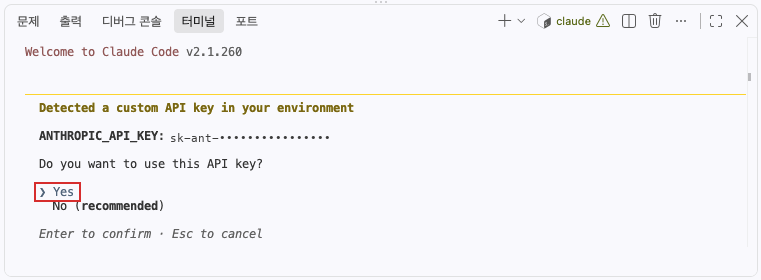
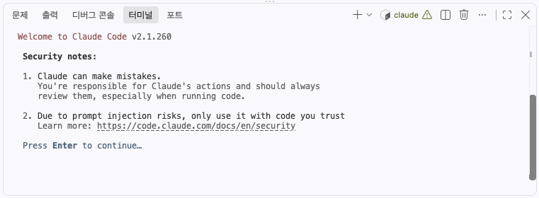
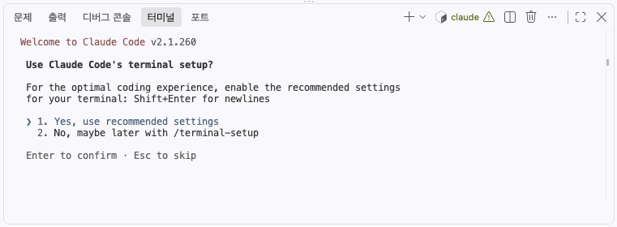
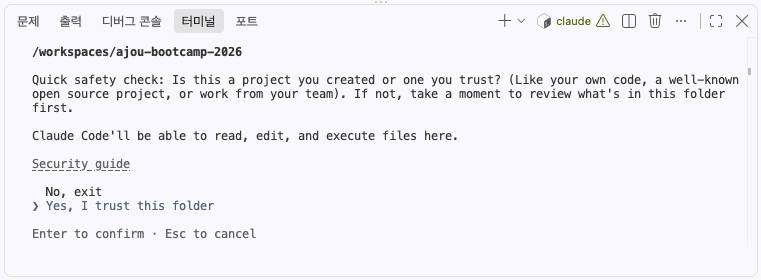
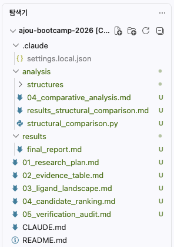

# ajou-bootcamp-2026

**KRAS G12C Drug Discovery Mini Project** — Claude Code를 research agent로 사용해
신약 후보를 "추천"받는 대신, **검증 가능한 연구 과정**을 만들어 보는 실습입니다.

연구 규칙과 워크플로우는 [CLAUDE.md](CLAUDE.md)에 정의되어 있고,
Claude Code가 세션 시작 시 자동으로 읽습니다.

---

## 1. 환경 준비

### 방법 A. GitHub Codespaces (권장)

이 저장소에서 **Code → Codespaces → Create codespace on main**.

컨테이너가 뜨면 실습에 필요한 것이 모두 설치된 상태입니다.
터미널에 `Setup complete!`가 보이면 준비가 끝난 것입니다.

> 무엇이 설치되는지는 [.devcontainer/post-create.sh](.devcontainer/post-create.sh) 참고

### 방법 B. 로컬 환경

Codespaces를 쓰지 않는 경우 Claude Code를 직접 설치합니다.

```bash
curl -fsSL https://claude.ai/install.sh | bash
```

설치 후 새 터미널을 열어 `claude --version`으로 확인합니다.
명령을 못 찾으면 `$HOME/.local/bin`이 `PATH`에 있는지 보세요.

---

## 2. Claude Code 설정

터미널에서 실행합니다.

```bash
claude
```

처음 실행하면 아래 네 화면이 순서대로 나옵니다. 순서대로 답하면 됩니다.

### 1. API key 확인 — `Yes`



`Yes`에 커서를 두고 **Enter**. 실습용 API key가 환경에 미리 설정되어 있고,
그 키를 쓰겠다고 답하는 화면입니다.

> `No (recommended)`라고 적혀 있지만 **이 실습에서는 Yes가 맞습니다.**
> 개인 Claude 계정으로 로그인해 쓰는 일반적인 상황을 기준으로 한 표시입니다.

### 2. Security notes — **Enter**



읽고 **Enter**. 선택지가 없는 안내 화면입니다.

### 3. 터미널 설정 — `1. Yes, use recommended settings`



`1`을 선택하고 **Enter**. 긴 프롬프트를 여러 줄로 입력할 때
**Shift+Enter**로 줄바꿈할 수 있게 해 줍니다. 4번 프롬프트를 붙여넣을 때 필요합니다.

### 4. 폴더 접근 권한 — `Yes, I trust this folder`



`Yes, I trust this folder`를 선택하고 **Enter**.
이 폴더의 파일을 읽고, 수정하고, 실행해도 되는지 묻는 확인입니다.
실습에서 Claude가 분석 스크립트를 만들고 실행해야 하므로 허용해야 진행됩니다.

경로가 `/workspaces/ajou-bootcamp-2026`인지 확인하고 선택하세요.
처음 여는 폴더마다 한 번씩 묻습니다.

### 모델 선택

```
/model      # → Sonnet 선택
```

Sonnet을 권장합니다. 이 실습은 tool call이 많아서 빠른 응답이 진행에 유리합니다.

그 밖에 알아 두면 좋은 명령:

```
/status     # 모델·API key·작업 디렉터리 확인
/mcp        # MCP 서버 연결 상태 확인
```

### API key 오류가 날 때

`Invalid API key · Fix external API key`가 뜨면 먼저 키가 실제로 거절되는지 확인합니다.

```bash
curl -s -o /dev/null -w "%{http_code}\n" https://api.anthropic.com/v1/models \
  -H "x-api-key: $ANTHROPIC_API_KEY" \
  -H "anthropic-version: 2023-06-01"
```

**`401`이 나오면** — 키 값 자체의 문제입니다. 접두사와 길이를 확인하세요.
붙여넣을 때 앞뒤에 공백이나 줄바꿈이 섞여 들어가는 경우가 가장 흔합니다.

```bash
echo "$ANTHROPIC_API_KEY" | cut -c1-15   # sk-ant-api03- 으로 시작하는지
echo -n "$ANTHROPIC_API_KEY" | wc -c     # 길이가 비정상적으로 길지 않은지
```

Codespaces secret을 고친 뒤에는 **Codespace를 재시작**해야 새 값이 반영됩니다.
터미널만 새로 열어서는 바뀌지 않습니다.

**`200`이 나오면** — 키는 정상이고 Claude Code가 예전에 저장한 다른 키를 쓰고 있는 것입니다.

```bash
claude auth logout
claude
```

> 시작할 때 나오는 `Remote managed settings failed to load (401)` 경고는
> 조직 단위 관리 설정을 못 받아왔다는 뜻입니다. **대화가 정상적으로 되면 무시해도 됩니다.**

---

## 3. 연구 도구 설치 — BioMCP · ToolUniverse

이 실습은 유전자·변이·논문·구조·화합물 데이터를 직접 조회합니다.
그 통로가 되는 도구 두 가지를 Claude Code 플러그인으로 설치합니다.

| 도구 | 쓰임 |
| --- | --- |
| **BioMCP** | gene, variant, drug, disease, article, pathway, clinical trial 검색 |
| **ToolUniverse** | protein/ligand 구조, PDB, binding pocket, 화합물 활성 등 1000+ 과학 도구 |

### BioMCP

BioMCP는 로컬 CLI를 먼저 설치한 뒤 플러그인을 붙입니다.

> **`claude`가 실행 중이면 먼저 빠져나오세요.**
> 앞 단계에서 `claude`를 켜 둔 상태라면 `/exit`를 입력하거나 **Ctrl+C를 두 번** 눌러
> 셸 프롬프트(`$`)로 돌아옵니다. 아래 `curl`은 Claude Code 프롬프트가 아니라
> **터미널(셸)에서** 실행하는 명령입니다. Claude와 대화하는 창에 그대로 붙여넣으면
> 명령이 실행되지 않고 Claude에게 보내는 메시지가 됩니다.

터미널에서:

```bash
curl -fsSL https://biomcp.org/install.sh | bash
```

`biomcp` 바이너리가 `~/.local/bin`에 설치됩니다. `biomcp --version`으로 확인하세요.

설치가 끝나면 `claude`를 다시 실행하고, 그 안에서 한 줄씩 입력합니다.

마켓플레이스 등록:

```
/plugin marketplace add genomoncology/biomcp
```

플러그인 설치:

```
/plugin install biomcp@biomcp
```

### ToolUniverse

ToolUniverse는 CLI 설치 없이 플러그인만 넣으면 됩니다.
`claude` 안에서 한 줄씩 실행합니다.

마켓플레이스 등록:

```
/plugin marketplace add mims-harvard/ToolUniverse
```

플러그인 설치:

```
/plugin install tooluniverse@tooluniverse
```

> ToolUniverse는 내부적으로 `uvx tooluniverse`로 실행됩니다.
> **방법 A(Codespaces)는 uv가 이미 설치**되어 있어 그대로 동작합니다.
> 방법 B(로컬)에서는 uv를 먼저 설치하세요 — `curl -fsSL https://astral.sh/uv/install.sh | sh`

### 설치 확인

플러그인 설치 후 Claude Code를 **재시작**하고:

```
/mcp        # tooluniverse가 ✓ Connected 인지 확인
/plugin     # biomcp, tooluniverse가 목록에 있는지 확인
```

첫 실행 때 ToolUniverse가 패키지를 내려받느라 수십 초 걸릴 수 있습니다.

---

## 4. 프롬프트 시작 예시

`claude`를 실행한 뒤 아래를 그대로 붙여넣습니다.

```
KRAS G12C를 표적으로 하는 새로운 신약 후보를 탐색하고 싶어.

Sotorasib을 출발점으로 해서, KRAS G12C를 표적으로 하는 알려진 리간드와 관련 근거를 조사하고, 후속 연구에서 우선 검증할 만한 후보를 찾아줘.

이 프로젝트에 설정되어 있는 지침을 따라 연구를 진행해줘.
단계적으로 진행하되, 중요한 연구 방향을 결정하거나 다음 단계로 넘어가기 전에는 현재까지의 결과와 다음에 하려는 일을 나에게 설명하고 허락을 받아줘.
```

마지막 두 문단이 핵심입니다.
[CLAUDE.md](CLAUDE.md)에 Phase와 CHECKPOINT가 정의되어 있어서, 이렇게만 지시하면
Claude가 research plan → evidence → ligand landscape → 비교 분석 → 후보 → 검증 감사
순서를 스스로 밟으면서 **체크포인트마다 멈추고 확인을 받습니다.**

멈춰 섰을 때가 실습의 본론입니다. 그대로 통과시키지 말고 되물어 보세요.

- `이 IC50은 biochemical이야 cellular야? assay 조건은?`
- `이건 관찰이야 추론이야? PDB ID랑 PMID 알려줘`
- `구조 근거만으로 그렇게까지 말할 수 있어?`

---

## 산출물

| 파일                     | 내용                                          |
| ------------------------ | --------------------------------------------- |
| 01_research_plan.md      | 계획 + 도구 가용성 (재확인 반영)              |
| 02_evidence_table.md     | RQ1 evidence A–F + Not Found 10건             |
| 03_ligand_landscape.md   | RQ2 4경로 열거 + 함정 3건                     |
| 04_candidate_ranking.md  | Tier A/B/C + 감사 후속 수정                   |
| 05_verification_audit.md | CHECKPOINT 4 재검증                           |
| results/final_report.md  | 최종 10개 섹션                                |
| analysis/                | 재실행 가능 스크립트 5개 + 원자료 mmCIF + TSV |
| logs/                    | 성공·실패 tool call 전량, 계획 변경 사유      |



---

## 결론 요약

**RQ1** — sotorasib의 공유결합을 원자료에서 직접 확인했습니다: `covale1 ... A CYS 12 SG ... MOV C25 ... 1.805`. 접촉 잔기 17개를 직접 계산했더니 H95/Y96/Q99가 나왔고, 이후 조회한 설계 논문이 독립적으로 같은 "cryptic pocket"을 지목했습니다.

**RQ2** — 275 ligand를 열거했고 G12C 구조 6종의 **consensus pocket 12잔기**를 도출했습니다. Cys12와 H95/Y96/Q99가 모두 core에 들어갑니다.

**RQ3** — **Olomorasib을 Tier A 단독**으로 제안했습니다. 다만 "약효 우위 아님"을 순위 **앞**에 명시했습니다 — D2(구조)를 가진 후보가 자동 상위에 오는 편향이 있고, 그건 활성 데이터를 못 구해서입니다.

---

## 마무리

인터랙티브 시각화 결과 보기!!

```
우리가 진행한 research에서 ligand-protein을 3d 시각화로 html로 만들어줄래? 
```
